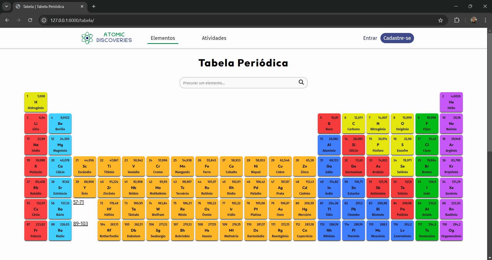
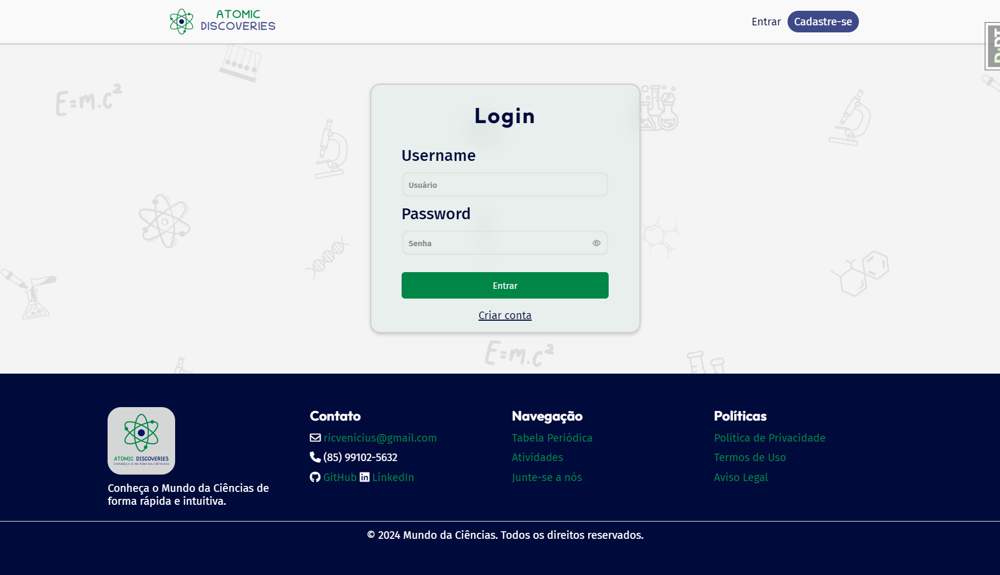
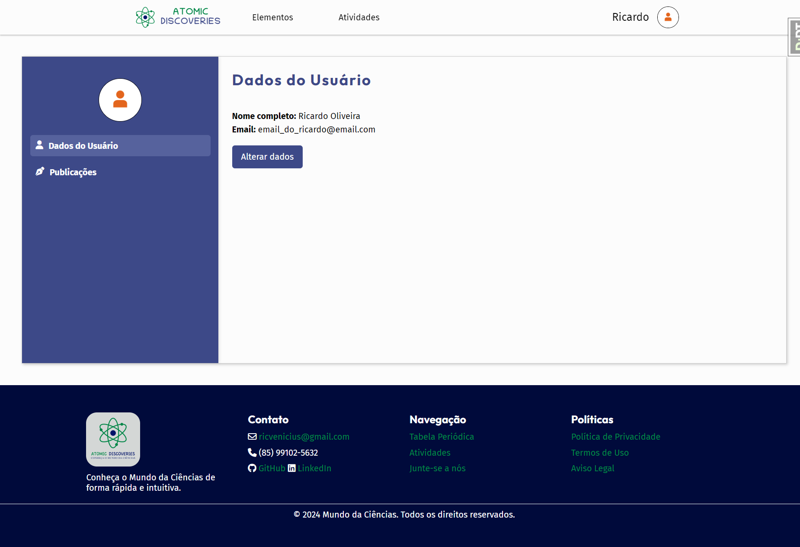
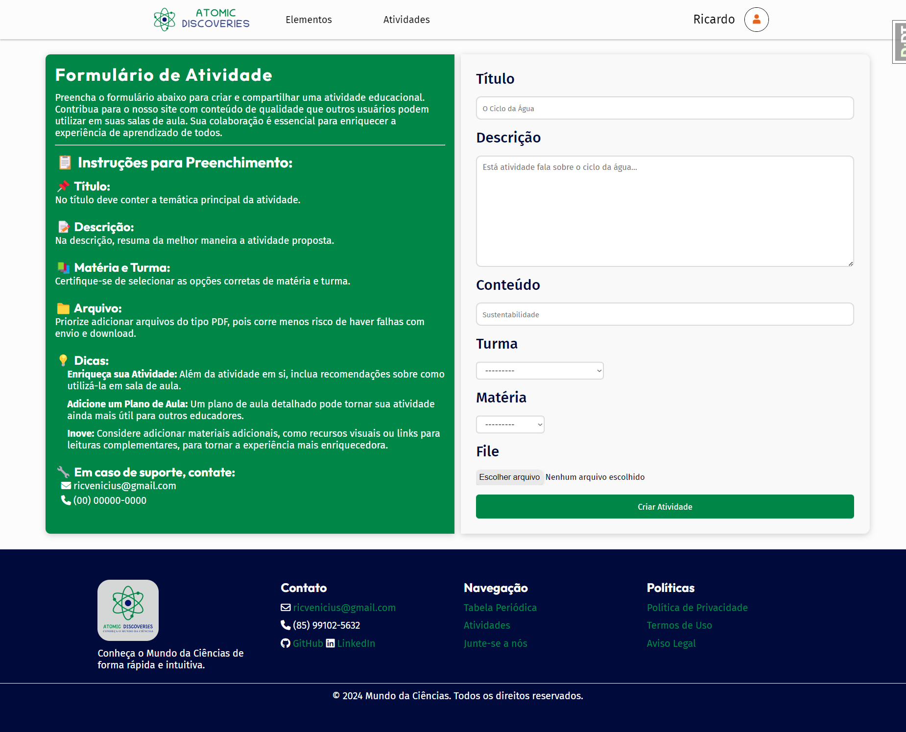
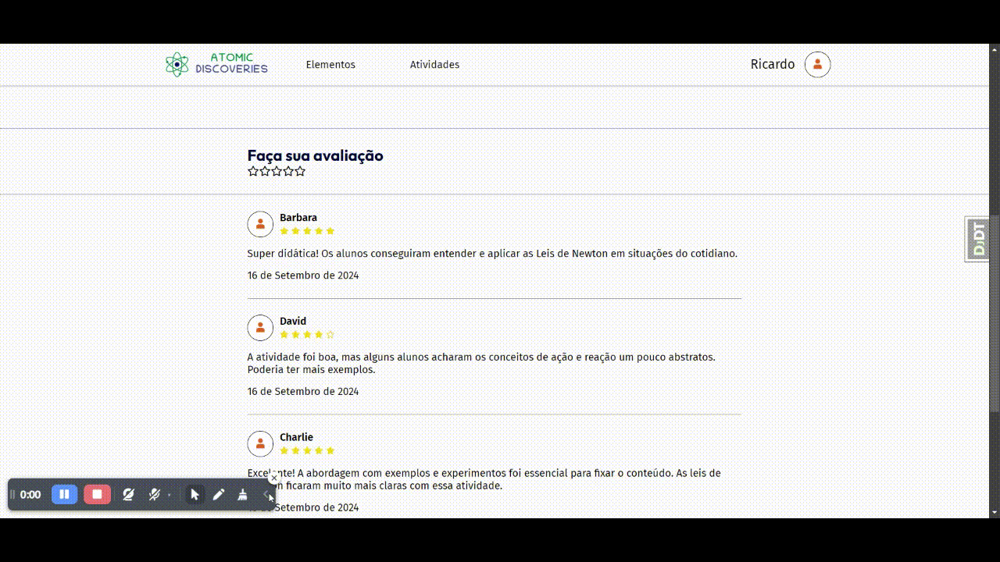

# ⚛️ Tabela Periodica

## 📚 Introdução

Bem-vindo ao projeto **Atomic Adventures**. Este website foi criado com o propósito de disseminar conhecimentos científicos de maneira interativa, acessível e criativa. Nossa missão é tornar o aprendizado de ciências uma experiência envolvente, utilizando recursos digitais para incentivar a curiosidade e o entendimento profundo dos conceitos científicos.


## 📦 Tecnologias Utilizadas e Dependências do Projeto


**Versão 3.12**
 - Usado para desenvolver todo o backend do site, incluindo views, models e a lógica principal do aplicativo.

 - **Pytest e Pytest-Django**

	- **Pytest** é um framework que auxilia na criação de testes funcionais escaláveis para aplicações e bibliotecas.

	- **Pytest-Django** é um plugin do Pytest que fornece ferramentas úteis para testes em aplicações Django.
	
 - **Coverage**
	- Ferramenta usada para monitorar e verificar quais partes do código backend estão sendo cobertas pelos testes.


**Versão: 5.1**
 - Framework utilizado para o desenvolvimento do site, responsável por configurar e administrar toda a estrutura de desenvolvimento web.


 - Linguagem de marcação para estruturação das páginas web.


 - Usado para estilizar as páginas web e garantir uma experiência de usuário agradável.


 - Usado para desenvolver a interatividade do site com o usuário, incluindo animações e botões de ativação.


## 🏛️ Arquitetura do Projeto
O projeto segue uma estrutura modular típica do Django, organizada em diferentes apps e diretórios para garantir escalabilidade e organização.

### Diretório `setup/`:

Criado a partir do comando `django-admin startproject`, o diretório **`setup/`** contém as configurações principais do projeto, incluindo variáveis de ambiente, segurança, e comportamento do servidor. Nele, estão definidas configurações como:

- **`SECRET_KEY`**: Chave secreta usada pelo Django para criptografia.
- **`DEBUG`**: Controla se o modo de depuração está ativado ou desativado.
- **`ALLOWED_HOSTS`**: Define quais hosts/domínios podem acessar o site.

Além disso, foram feitas as seguintes configurações personalizadas:

- Na constante **`TEMPLATES`**, foi adicionado o diretório **`base_templates/`** para centralizar os templates principais reutilizáveis, como `header` e `footer`.

  ```python
  TEMPLATES = [
      {
          'DIRS': [
            BASE_DIR / 'base' / 'base_templates',
        ],
      },
  ]
  ```

- Na constante **`STATICFILES_DIRS`**, foi incluído o diretório **`base_statics/`**, que gerencia os arquivos estáticos globais (CSS e JS) utilizados em todo o site.

  ```python
  STATICFILES_DIRS = [
    os.path.join(BASE_DIR, 'base/base_statics'),
	]
  ```

### Estrutura base de um app Django:

Cada app no projeto contém os seguintes arquivos e diretórios principais:

- **`models.py`**: Define os modelos de dados.
- **`views.py`**: Define as views responsáveis pela lógica do aplicativo.
- **`admin.py`**: Configura a interface de administração do Django para o app.
- **`urls.py`**: (adicionado manualmente) Gerencia as URLs específicas do app.
- **`tests/`**: Diretório com arquivos de teste para garantir a funcionalidade dos modelos, views, etc.
- **`templates/`** e **`static/`**: Diretórios para os arquivos de template e recursos estáticos (CSS, JS, imagens) específicos do app.

### Diretório `base/`:

O diretório **`base/`** é responsável pela estruturação global do site e contém:

- **`base_templates/`**: Aqui ficam os templates principais do site, como `header`, `footer`, e outras partes reutilizáveis que compõem a base do layout.
- **`base_statics/`**: Contém os arquivos CSS e JavaScript que estilizam e dinamizam os componentes do `base_templates`, garantindo a consistência visual e funcional em todas as páginas do site.

### Configuração do diretório de mídias:

Os arquivos de mídia (imagens enviadas, documentos, etc.) são armazenados no diretório `media`, configurado no arquivo `settings.py`:

```python
MEDIA_URL = '/media/'
MEDIA_ROOT = os.path.join(BASE_DIR, 'media')
```

No `urls.py` do diretório principal, adicionamos as configurações para servir arquivos de mídia durante o desenvolvimento:

```python
from django.conf import settings
from django.conf.urls.static import static

urlpatterns = [
    # Rotas do projeto
]

if settings.DEBUG:
    urlpatterns += static(settings.MEDIA_URL, document_root=settings.MEDIA_ROOT)
```


## 🔧 Instalação e Configuração

Para configurar e executar o projeto **Tabela Periodica** em sua máquina local, siga as etapas abaixo:

1. **Pré-requisitos:**
   - **Python:** 3.12
   - **Pip:** Última versão

2. **Crie um diretório para o projeto:**
   Execute no terminal (substitua `"nome_do_diretorio"` pelo nome desejado):

   ```bash
   mkdir "nome_do_diretorio"
   ```

   Se necessário, escolha a pasta onde será criado o diretório:

   ```bash
   cd "caminho_da_pasta"
   ```

3. **Clone o repositório:**
   Acesse o diretório criado e clone o repositório:

   ```bash
   cd "nome_do_diretorio"
   git clone git@github.com:Ric002x/TabelaPeriodica.git .
   ```
   > O ponto ao final do comando é necessário para que os arquivos sejam colocados na raiz do diretório.

4. **Crie e ative o ambiente virtual (opcional, mas recomendado):**

   - **Criar:**
     - **Windows:**
     ```bash
     python -m venv venv
     ```
     - **macOS/Linux:**
     ```bash
     python3 -m venv venv
     ```

   - **Ativar:**
     - **Windows:**
     ```bash
     .\venv\Scripts\activate
     ```
     - **macOS/Linux:**
     ```bash
     source venv/bin/activate
     ```

5. **Instale as dependências:**
   ```bash
   pip install -r requirements.txt
   ```

6. **Renomeie e edite o arquivo de variáveis de ambiente:**
   ```bash
   mv .env-example .env
   ```

   Adicione caracteres aleatórios à constante **`SECRET_KEY`** no arquivo `.env`:

   ```python
   SECRET_KEY="insira caracteres aqui"
   ```

7. **Execute as migrações do banco de dados:**
   ```bash
   python manage.py migrate
   ```
   > Esse comando cria as tabelas no banco de dados.

8. **Importe os dados principais do site:**
   Os arquivos necessários para importação estão localizados em `/app/management/commands/`.

   Execute os seguintes comandos:

   ```bash
   python manage.py import_elements
   ```

   ```bash
   python manage.py import_levels
   ```

   ```bash
   python manage.py import_subjects
   ```
   > Esses comandos irão importar elementos químicos, turmas e matérias.

9. **Execute os testes:**
   Para executar os testes, utilize um dos comandos abaixo com o ambiente virtual ativado:

   ```bash
   python manage.py test
   ```

   Ou

   ```bash
   pytest
   ```

   > Ambos os comandos executarão todos os testes nos diretórios dos apps, garantindo a funcionalidade do site.

10. **Inicie o servidor de desenvolvimento:**
   Após a execução bem-sucedida dos testes, inicie o servidor:

   ```bash
   python manage.py runserver
   ```

   O servidor estará disponível em: [http://127.0.0.1:8000](http://127.0.0.1:8000)

   > Em caso de falha dos testes, entre em contato na seção de Suporte.


## 🔗 API do Site

A API do site foi construída utilizando o Django Rest Framework (DRF), uma biblioteca robusta e flexível para a criação de APIs seguras e escaláveis em projetos Django. Com o DRF, foi possível implementar uma interface que permite a comunicação eficiente entre o frontend e o backend, oferecendo diversas funcionalidades como autenticação, controle de permissões e serialização de dados.

Nossa API segue o padrão RESTful, utilizando o formato JSON para envio e recebimento de dados, o que facilita a integração e o consumo dos serviços oferecidos. Cada um dos aplicativos (apps) do projeto possui endpoints específicos, adaptados para suas necessidades e funcionalidades, com suporte a métodos HTTP como GET, POST, PATCH e DELETE, conforme apropriado.

Para facilitar o acesso e a organização, todos os endpoints iniciam com o prefixo `/api`. Abaixo, você encontrará uma descrição detalhada de cada endpoint, incluindo os métodos disponíveis, parâmetros aceitos e exemplos de uso, proporcionando uma visão completa para integração e uso da API em diferentes contextos.


### API de Elementos:

A API de Elementos permite o acesso aos dados de elementos químicos armazenados no banco de dados da aplicação, retornando informações essenciais como símbolo, massa atômica, número de prótons, entre outros detalhes. Abaixo estão descritos os endpoints disponíveis para listar todos os elementos e buscar informações específicas sobre um elemento individual.

Nesta API, o único método HTTP disponível é o **GET**, sendo usado apenas para leitura/visualização dos dados.

#### Método HTTP: GET

**GET List: Listagem de Elementos**
- **Endpoint**: `/api/elementos/`

- **Descrição:** Retorna uma lista de objetos, onde cada objeto representa um elemento químico com informações básicas, incluindo:

   - `atomic_number` (int): Número atômico do elemento
   - `name` (string): Nome do elemento
   - `atomic_mass` (float): Massa atômica do elemento
   - `symbol` (string): Símbolo químico do elemento
   - `state_matter` (string): Estado físico do elemento à temperatura ambiente (ex.: sólido, líquido, gasoso)
   - `electronic_configuration` (string): Configuração eletrônica do elemento

- **Status de Resposta**:
   - **200 OK**: Sucesso


**GET Object: Consulta de Elemento Específico**
- **Endpoint**: `/api/elementos/<elemento>`
   - Substitua <elemento> pelo símbolo do elemento (exs.: "H" para Hidrogênio; ou "He" para "Hélio").

- **Descrição**: Retorna um objeto com informações detalhadas do elemento, incluindo:

   - `atomic_number` (int): Número atômico
   - `name` (string): Nome do Elemento
   - `atomic_mass` (float): Massa atômica
   - `symbol` (string): Símbolo do Elemento
   - `state_matter` (string): Estado físico do elemento à temperatura ambiente
   - `electronic_configuration` (string): Configuração eletrônica
   - `electrons_qty` (int): Número de elétrons
   - `neutrons_qty` (int): Número de nêutrons
   - `electron_distribution` (string): Distribuição eletrônica detalhada
   - `ionic_states` (list): Possíveis estados iônicos do elemento
   - `density` (float): Densidade do elemento (g/cm³)
   - `melting_point` (object): Ponto de fusão, com valores em Kelvin, Celsius e Fahrenheit
   - `boiling_point` (object): Ponto de ebulição, com valores em Kelvin, Celsius e Fahrenheit

- **Status de Resposta**:
   - **200 OK**: Sucesso
   - **404 Not Found** Elemento não encontrado


### API de Autenticação por JWT

A API de JWT (JSON Web Token) permite a criação, verificação e "atualização" de tokens que servirão para autenticação de usuários. Todas as urls presentes nesta api funcionam pelo método `HTTP POST`, sendo necessário envio de corpo JSON.

A autenticação por JWT será requirida em diversas partes da API, pois será necessário autenticação de um usuário durante a requisição de diversos endpoints.

#### Token Create

Cria os tokens de acesso (access_token) e atualização (refresh_token) para o usuário passado na requisição.

- **Endpoint**: `/usuarios/api/token/`

- **Corpo da requisição**:

```json
{
   "username": "usuário",
   "password": "senha",
}
```

- **Retorno da requisição**:

```json
{
   "refresh": "refresh_token",
	"access": "access_token"
}
```

- **Status de Resposta**:
   - **200 OK**: Sucesso
   - **400 Bad request**: Erro no corpo da requisição
   - **401 Unauthorized**: Dados de usuário não encontrado ou incorretos


#### Token verify

Validação do token de acesso passado na requisição.

- **Endpoint**: `/usuarios/api/token/verify`

- **Corpo da requisição**:

```json
{
   "token": "access_token"
}
```

- **Retorno da requisição**:

```json
{
	"access": "access_token"
}
```

- **Status de Resposta**:
   - **200 OK**: Sucesso
   - **400 Bad request**: Erro no corpo da requisição
   - **401 Unauthorized**: Tóken inválido ou expirado

#### Token Refresh

Atualiza o access_token expirado utilizando o refresh_token, sem haver a necessidade do usuário fazer uma nova autenticação.

- **Endpoint**: `/usuarios/api/token/refresh`

- **Corpo da requisição**:

```json
{
   "refresh": "refresh_token"
}
```

- **Status de Resposta**:
   - **200 OK**: Sucesso (token válido)
   - **400 Bad request**: Erro no corpo da requisição
   - **401 Unauthorized**: Tóken inválido ou expirado


### API de Usuários

A API de Usuários permite a criação, atualização e exibição de informações de usuários registrados.

#### Método HTTP: GET

- **Endpoint**: `/usuarios/api/<usuario>`
   - Substitua <usuario> pelo `username` do usuário que deseja encontrar.
- **Requisitos de Autenticação**: JWT obrigatório. Usuário deve estar autenticado via token JWT.

- **Descrição**: Retorna as informações detalhadas do usuário autenticado. Incluindo:

   - `username` (string): ... do usuário
   - `fist_name` (string): Primeiro nome do usuário
   - `last_name` (string): Sobrenome do usuário
   - `email` (string): E-mail do usuário

- **Status de Resposta**:
   - **200 OK**: Sucesso
   - **404 Not Found** Usuário não encontrado


#### Método HTTP: POST

- **Endpoint**: `/usuarios/api/`

- **Descrição**: Descrição: Cria um novo usuário com os dados fornecidos. Todos os campos são obrigatórios e precisam ser validados antes de completar o cadastro. Os dados devem ser enviados em formato JSON no corpo da requisição com os seguintes campos:

   - `username` (string): Nome de usuário único para o novo usuário.
   - `email` (string): Endereço de e-mail válido.
   - `first_name` (string): Primeiro nome do usuário.
   - `last_name` (string): Sobrenome do usuário.
   - `password` (string): Senha do usuário.
   - `password2` (string): Confirmação da senha. Deve ser idêntico ao campo password.
   - `agree_to_terms` (booleano): Indica que o usuário concorda com os termos de serviço.

- **Status de Resposta**:
   - **200 OK**: Sucesso
   - **400 Bad request** Erro no corpo da requisição


#### Método HTTP: PATCH

- **Endpoint**: `/usuarios/api/<usuario>/`
   - Substitua <usuario> pelo username do usuário que deseja atualizar.
- **Requisitos de Autenticação**: JWT obrigatório. O usuário deve estar autenticado e apenas o próprio usuário pode atualizar suas informações.

- **Descrição**: Atualiza as informações de um usuário autenticado. Todos os campos são opcionais e podem ser atualizados individualmente. As senhas possuem uma view específica para atualização e não devem ser incluídas aqui. O campo `agree_to_terms` é obrigatório e deve permanecer `True`, sem a necessidade de ser enviado novamente.
   - **Campos**:
      - `username` (string, opcional): Novo nome de usuário. Deve ser único.
      - `email` (string, opcional): Novo endereço de e-mail válido. Deve ser único.
      - `first_name` (string, opcional): Novo primeiro nome.
      - `last_name` (string, opcional): Novo sobrenome.


### API de Atividades

A API de Atividades é projetada para criar, listar, atualizar e excluir atividades educacionais. Cada método possui sua própria especificidade e funcionamento.

#### Método HTTP: GET

**GET List: Lista de Atividades Publicadas**
- **Endpoint**: `/learn-lab/api/atividades/`

- **Descrição**: Retorna uma lista de atividades publicadas, incluíndo:
   - `title` (string): Título da atividade
   - `activity_slug` (string): Slug da atividade
   - `description` (string): Descrição da atividade
   - `activity_link` (string): Link da atividade
   - `content` (string): Conteúdo da atividade
   - `subject` (object):
      - `id` (int): ID do conteúdo
      - `name` (string): Nome do conteúdo
   - `level` (object):
      - `"id"` (int): ID da turma,
      - `"name"` (string): Nome da turma,
   - `user` (object):
      - `"id"` (int): ID do usuário,
      - `"name"` (string): Username do usuário,
   - `file` (string): Link do arquivo
   - `thumbnail` (string): Link da imagem do arquivo

**GET Object: Consulta de Atividade Específica**
- **Endpoint**: `/learn-lab/api/atividades/<atividade>`
   - Substitua <atividade> pela slug da atividade (ex.: use "o-ciclo-da-agua" para O Ciclo da Água).

- **Descrição**: Retorna os detalhes completos de uma atividade específica, com os mesmos campos incluídos na listagem.

- **Status de Resposta**:
   - **200 OK**: Sucesso
   - **404 Bad** Atividade não encontrada


#### Método HTTP: POST

- **Endpoint**: `/learn-lab/api/atividades/`
- **Requisitos de Autenticação**: JWT obrigatório. Usuário deve estar autenticado via token JWT.

- **Descrição**: Permite que um usuário autenticado crie uma nova atividade. O corpo da requisição deve estar no formato de formulário multipart, para permitir o envio de arquivos `PDF`.
   - **Observações Importantes**:
      - O campo `thumbnail` é gerado automaticamente a partir do PDF enviado.
      - O campo `user` é preenchido automaticamente a partir do usuário autenticado.
      - Os campos `subject` e `level` são IDs que se referem a registros em outras tabelas
      - Os campo `slug` é preenchido automaticamente a partir do título da atividade
      
   - **Corpo da requisição**:
      - `title` (string): Título da atividade
      - `description` (string): Descrição breve
      - `content` (string): Conteúdo detalhado
      - `subject` (int): ID da matéria (obtido de outra tabela)
      - `level` (int): ID da turma (obtido de outra tabela)
      - `file` (string): Arquivo PDF associado à atividade (upload em `multipart`)

- **Status de Resposta**:
   - **200 OK**: Atualização realizada com sucesso
   - **400 Bad** Request: Dados inválidos
   - **401 Unauthorized**: Falha na autenticação ou JWT não inserido


#### Método HTTP: PATCH

- **Endpoint**: `/learn-lab/api/atividades/<atividade>`
   - Substitua <atividade> pela slug da atividade (ex.: use "o-ciclo-da-agua" para O Ciclo da Água).
- **Requisitos de Autenticação**: JWT obrigatório. Usuário deve estar autenticado via token JWT.

- **Descrição**: Permite que um usuário, criador de determinada atividade, edite suas informações, alterando somente os campos desejados.

- **Status de Resposta**:
   - **200 OK**: Atualização realizada com sucesso
   - **400 Bad** Request: Dados inválidos
   - **401 Unauthorized**: Falha na autenticação ou JWT não não inserido
   - **403 Fobidden**: Proibido o acesso para o usuário autenticado


#### Método HTTP: DELETE

- **Endpoint**: `/learn-lab/api/atividades/<atividade>`
   - Substitua <atividade> pela slug da atividade (ex.: use "o-ciclo-da-agua" para O Ciclo da Água).
- **Requisitos de Autenticação**: JWT obrigatório. Usuário deve estar autenticado via token JWT.

- **Descrição**: Permite que um usuário, criador de determinada atividade, exclua a atividade criada.

- **Status de Resposta**:
   - **200 OK**: Atualização realizada com sucesso
   - **401 Unauthorized**: Falha na autenticação ou JWT não não inserido
   - **403 Fobidden**: Proibido o acesso para o usuário autenticado


## 📝 Descrição dos Apps


### App 1: Tabela Peridoca (periodic_table)

O app Tabela Periódica, temática principal do site, é projetado para explorar detalhadamente os elementos químicos da tabela periódica. Este aplicativo fornece uma visão abrangente sobre os elementos, desde uma visão geral da tabela até informações detalhadas sobre cada elemento individualmente.

**Funcionalidades Principais:**

- **Página Inicial**: Serve como ponto de partida para navegação no site.

- **Tabela Periódica**: Exibe a tabela periódica completa com informações básicas sobre cada elemento.

- **Detalhes dos Elementos**: Fornece uma página dedicada para cada elemento químico, com detalhes aprofundados sobre suas propriedades e aplicações.

- **Políticas do Site**: Inclui uma página com as diretrizes e políticas do site para garantir a conformidade e transparência.


### App 2: Usuários (users)

O app Usuários é responsável pela gestão e controle das funcionalidades relacionadas aos usuários do site. Ele gerencia o processo de cadastro, login e logout, e oferece funcionalidades adicionais que estão disponíveis exclusivamente para usuários registrados.

**Funcionalidades Principais:**

- **Cadastro e Login**: Permite que novos usuários se registrem no site e que usuários existentes façam login para acessar suas contas.

- **Perfil de Usuário**: Oferece uma seção de perfil onde os usuários podem visualizar e gerenciar suas informações pessoais, como nome de usuário, endereço de e-mail, imagem de perfil e senha.

- **Administração de Dados**: Facilita a atualização e manutenção dos dados do usuário, assegurando que as informações pessoais estejam sempre atualizadas e seguras.

- **Funcionalidades Exclusivas**: Algumas funções do site, como a personalização do perfil e o acesso a certas seções e recursos, estão disponíveis apenas para usuários registrados.

Objetivo: O app Usuários é fundamental para a gestão da interação dos usuários com o site, oferecendo uma experiência personalizada e segura. Embora o acesso básico ao site não exija cadastro, as funcionalidades avançadas e personalizadas estão disponíveis exclusivamente para usuários que se registram e mantêm uma conta ativa.


### App 3: Laboratório de Atividades (learn_lab)

Descrição: O app Laboratório de Atividades é dedicado à gestão de atividades educacionais postadas pelos usuários do site. Este aplicativo permite o gerenciamento completo de atividades, incluindo a postagem, edição, exclusão e visualização de conteúdos educacionais criados pelos usuários.

**Funcionalidades Principais:**

- **Postagem de Atividades**: Os usuários podem criar e publicar atividades educacionais, como exercícios e jogos didáticos, que serão disponibilizados para outros usuários.

- **Gestão de Conteúdo**: Permite a edição e exclusão de atividades já postadas, garantindo que o conteúdo possa ser atualizado ou removido conforme necessário.

- **Documentação em PDF**: Cada atividade deve ser acompanhada por um arquivo PDF que contenha todas as informações necessárias para a implementação em sala de aula. Este PDF é acessível para download pelos demais usuários.

- **Recomendações de Criação**: A página de criação de atividades oferece recomendações e diretrizes para ajudar os usuários a criar conteúdos de qualidade.

- **Sistema de Avaliação**: As atividades podem ser avaliadas por outros usuários, que podem deixar comentários sobre a qualidade e a utilidade das atividades. O acesso a essas funcionalidades exige que o usuário esteja registrado no site.

Objetivo: O Laboratório de Atividades visa proporcionar um espaço interativo e colaborativo para a criação e compartilhamento de recursos educacionais. Ele facilita a publicação e a avaliação de materiais didáticos, incentivando a participação ativa dos usuários e a melhoria contínua dos conteúdos oferecidos.


## 💻 Uso do Site

Nesta seção, abordaremos como o usuário pode navegar e interagir com o site **Atomic Adventures**. Você encontrará descrições das principais páginas, orientações sobre como utilizar as funcionalidades disponíveis, e dicas para maximizar sua experiência no site.

### Base do Site

#### Cabeçalho e Rodapé

O site conta com dois elementos fundamentais para a navegação: o Cabeçalho (header) e o Rodapé (footer). Ambos estão presentes em todas as páginas do site, garantindo fácil acesso às principais áreas de navegação e links importantes.

 - **Cabeçalho:**

	.png)

	- **Logo**: A logo do site é um elemento visual que também funciona como um link para a página principal. Ela foi estilizada para ter um caráter único e acolhedor, refletindo a identidade do projeto.

	- **Área de navegação**: Nesta seção, os usuários encontram links para as principais páginas do site, como a Tabela Periódica, Atividades, e as políticas do site. A navegação é simples e direta, facilitando o acesso a diferentes partes do site.

	- **Controle de usuário**: Essa área oferece acesso rápido aos links de login e cadastro. Para usuários autenticados, o controle de usuário se expande, permitindo acesso ao perfil e às publicações feitas pelo próprio usuário.

 - **Rodapé**:

	.png)

	- **Contato**: Esta seção inclui informações de contato, como email, telefone, e links para redes sociais (Instagram e LinkedIn). É uma forma de manter a comunicação aberta com a comunidade e os visitantes do site.

	- **Navegação**: O rodapé também contém links para as principais seções do site, como a Tabela Periódica, Atividades, e a página de cadastro. Esses links oferecem uma navegação rápida para áreas essenciais.

	- **Políticas do Site**: Nesta parte, estão disponíveis links para as políticas de privacidade, termos de uso, e aviso legal, garantindo que os usuários tenham fácil acesso às informações legais e de privacidade do site.

### App: Tabela Periódica (periodic_table)

#### 1. Página Principal

A página inicial oferece uma visão geral do propósito do site, convidando o usuário a explorar a Tabela Periódica e outros recursos científicos (em desenvolvimento).

- **Introdução**: Breve descrição e botão de acesso à Tabela Periódica.
- **Exploração de Áreas Científicas**: Futuros conteúdos de química, física e biologia (a desenvolver).
- **Sobre o Site**: Objetivos principais (educação científica, colaboração e criatividade).


#### 2. Tabela Periódica

A página da Tabela Periódica, temática principal do site, oferece uma apresentação rápida dos elementos químicos. Ela foi projetada para ser simples e intuitiva, permitindo aos usuários acessar rapidamente as informações mais relevantes sobre cada elemento.s

##### Visualização da Tabela

A Tabela Periódica é apresentada de forma simples, com informações essenciais sobre cada elemento.

- Nome, Número Atômico, Símbolo Químico, Massa Atômica.
- Campo de pesquisa para encontrar elementos por nome ou número.




##### Páginas Individuais dos Elementos:

Cada elemento tem uma página dedicada com:

- **Cabeçalho**: Nome, Classificação, Número Atômico, Símbolo, Massa Atômica.
- **Introdução e Navegação**: Breve descrição, botões para navegar entre elementos.
- **Seções**: Elétrons, Propriedades Físicas e Atômicas, História, Aplicações.


 Lista os artigos, sites e livros utilizados para a pesquisa das informações apresentadas.

### App: Usuários (users)

O app **`Users`** é um componente do site que gerencia todas as funcionalidades relacionadas aos usuários. Ele permite a criação e manutenção de perfis de usuários, oferecendo recursos para registro, login, atualização de informações pessoais, e gerenciamento de perfis, incluindo a atualização de fotos de perfil. Além disso, o app controla o acesso a páginas restritas do site, como dashboards personalizados, e possibilita futuras expansões para funcionalidades como atividades salvas e interações entre usuários. Ele foi projetado com foco na segurança e usabilidade, integrando autenticação robusta e opções de personalização para melhorar a experiência do usuário.

#### Segurança no Cadastro e Autenticação

- **Cadastro**: Coleta Nome, Sobrenome, Nome de Usuário, E-mail e Senha, com verificação em dois campos para evitar erros de digitação. Inclui aceitação dos Termos de Uso.
  
- **Autenticação**: Login por Nome de Usuário e Senha, com verificação segura contra o banco de dados.
  
- **Logout Seguro**: Encerra a sessão de forma segura, limpando dados do navegador.

Esses processos garantem que apenas usuários autenticados tenham acesso a áreas restritas.



#### Gerenciamento de Perfil

O Gerenciamento de Perfil no app Users oferece aos usuários a capacidade de modificar suas informações pessoais diretamente através do site. Caso necessitem corrigir algum erro cometido durante o cadastro ou atualizar suas informações, os usuários podem alterar dados como Nome, Sobrenome, Nome de Usuário, E-mail, Foto de Perfil e Senha. Essa funcionalidade é essencial para garantir que as informações de cada usuário estejam sempre atualizadas e precisas.

Atualmente, o sistema permite a troca de senha diretamente no perfil, mas ainda não inclui uma opção para redefinir a senha em caso de esquecimento. Esse recurso está em fase de desenvolvimento e será implementado no futuro, garantindo uma experiência ainda mais completa e segura para os usuários.



#### Gerenciamento de Atividades

A funcionalidade de Gerenciamento de Atividades no app Users permite aos usuários a administração completa das atividades que eles criaram no site. Esta área é acessível diretamente através do perfil do usuário, oferecendo um controle centralizado sobre o conteúdo gerado por eles.

**Acesso e Edição de Atividades**

Os usuários podem visualizar uma lista de todas as atividades que criaram, organizadas em uma interface intuitiva. Cada atividade inclui opções para edição e exclusão. O usuário pode selecionar qualquer atividade da lista para modificá-la, o que permite atualizar detalhes como título, descrição e outros campos específicos.

**Exclusão de Atividades**

Além da edição, o usuário tem a opção de excluir atividades. A exclusão remove permanentemente a atividade do sistema. A confirmação de exclusão é necessária para evitar remoções acidentais, garantindo que o usuário esteja ciente de que a ação é irreversível.


### App: Laboratório de Atividades (learn_lab)

O app **`Learn Lab`** é uma plataforma desenvolvida para fomentar a criação, publicação e compartilhamento de atividades educacionais interativas, com um foco especial em ciências. Este app oferece um ambiente onde usuários podem explorar e contribuir com atividades didáticas que abrangem várias disciplinas.

#### Acesso e Funcionalidades

- **Acesso Público**: Qualquer visitante pode visualizar as atividades sem a necessidade de login.
- **Funcionalidades Extras para Usuários Autenticados**:
  - Criar e publicar atividades com título, descrição, matéria e arquivos complementares.
  - Editar ou excluir suas atividades.
  - Avaliar e comentar atividades de outros usuários.

#### Estrutura das Atividades

Cada atividade inclui:
- **Título**
- **Descrição**
- **Conteúdo**
- **Matéria e Turma**
- **Arquivo em PDF**

#### Pesquisa e Navegação

Os usuários podem buscar atividades por:
- **Nível de Turma**
- **Matéria**
- **Campo de Busca Geral**: Localizado no topo da página.

#### Submissão e Aprovação de Atividades

- Após a criação, atividades passam por uma revisão.
- Edições feitas em atividades aprovadas são novamente analisadas antes de serem publicadas.


#### Página de Detalhes da Atividade

Exibe:
- Descrição detalhada.
- Botão de download do PDF.
- Seção de avaliações e comentários.


#### Criação e Edição de Atividades

- **Criação**: Formulário simples com orientações para preencher corretamente.
- **Edição**: Campos pré-preenchidos para facilitar ajustes.



#### Avaliações

- **Sistema de Estrelas (1 a 5)** e comentários opcionais.
- Cada usuário pode avaliar uma única vez por atividade, com opção de edição e exclusão da avaliação.




## ✒️ Próximas Atualizações

Embora o site já tenha as funcionalidades essenciais prontas e funcionando, ainda há várias adições e melhorias planejadas para aprimorar a experiência do usuário e expandir as capacidades do site. Entre as próximas atualizações esperadas, estão:

### Atualizações de Backend
- **"Esqueci minha senha"**: Desenvolver uma view que permita ao usuário alterar sua senha a partir do e-mail, em caso de esquecimento ou perda da senha.

- **Imagem do PDF**: Desenvolver um script que transforma a primeira folha do PDF em uma imagem para ser mostrada no template de atividades.

- **Visualização de Perfil**: Implementação de uma view personalizada que permite acessar as informações básicas de um usuário, como nome, sobrenome e biografia. Além disso, possibilita a visualização das atividades criadas por esse usuário.

### Atualizações de Frontend
- **Expansão de Conteúdo**: Adicionar mais detalhes e informações sobre os elementos químicos para enriquecer o conteúdo disponível e oferecer uma visão mais abrangente. Incluir links para sites que promovem software de jogos educativos e simuladores de experiências.

- **Otimização para Dispositivos Móveis**: Melhorar a responsividade do site para garantir uma experiência fluida em todos os dispositivos, incluindo smartphones e tablets.

Estas atualizações visam tornar o site ainda mais útil e agradável para os usuários, e estamos ansiosos para implementar essas melhorias nas próximas versões.


## 📜 Licença

Este projeto é licenciado sob a Licença MIT - veja o arquivo [LICENSE](./LICENSE) para mais detalhes.


## 💬 Contato

Se você tiver dúvidas, sugestões ou encontrar problemas, sinta-se à vontade para entrar em contato.

Você pode me encontrar e me contatar através das minhas redes sociais na [minha overview do GitHub](https://github.com/Ric002x).

Agradeço pelo seu interesse no projeto! 😁